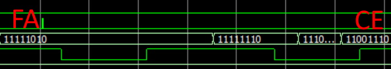
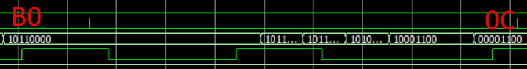

# UART

A UART Tx/Rx Module in VHDL

## Information

The UART module in VHDL available on github [nandland](https://github.com/nandland/nandland/tree/master/UART/VHDL/source) provides serial communication with asynchronous rx/tx UART. Inside the behavioral code (UART_RX.vhd) I have noticed that the sampling is done 1 time in the middle of the bit duration (g_CLKS_PER_BIT/2):

[nandland](./uart_byte_sampling.png)

That approach can be sufficient mainly in lab/test environments but is actually inadequate in real/production environments where noise, internal clock jitter and lost of sync between TX-RX requires increased sampling rate.

The improved data sampling technique is described in more detail [here](https://www.maximintegrated.com/en/design/technical-documents/tutorials/2/2141.html).
**"The receive UART uses a clock that is 16 times the data rate"**

So, my changes focuses on checking the START birt not olny on the 8th clock count (g_CLKS_PER_BIT/2), but also on the 7th (-1) and on the 9th (+1) clock counts as well. Following the rule below:

**"Another improvement is to sample the START bit three times (clock counts 7, 8, and 9, out of 16) instead of sampling it only at the midbit position (clock count 8 out of 16)"**

**Behavioral VHDL code**: UART_RX.vhd , UART_TX.vhd  
**Testbench VHDL code**: UART_TB.vhd  

**Modelsim**:  

## Licence

Copyright (c) 2019 Stavros Kalapothas (aka Stevaras) <stavros@ubinet.gr>.
It is free software, and may be redistributed under the terms of the GNU Licence.